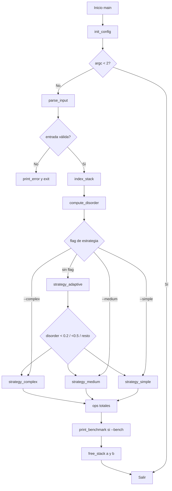

# Análisis detallado del repositorio `Push_swap`

## 1) Estructura general

- `/Makefile`: compila `push_swap` y primero fuerza compilación de `Libft/libft.a`.
- `/includes/push_swap.h`: contratos del proyecto (`t_stack`, `t_config`, prototipos).
- `/src`: lógica principal de `push_swap` (parsing, operaciones, estrategias, utilidades).
- `/Libft`: librería estática de utilidades C reutilizada por `push_swap`.

## 2) Cómo se conecta todo (visión global)

1. `main` inicializa configuración y pilas.
2. `parse_input` interpreta flags y números, valida formato/rango/duplicados.
3. `index_stack` normaliza valores a índices ordenados.
4. `compute_disorder` mide desorden de entrada.
5. `execute_strategy` selecciona estrategia (`simple`, `medium`, `complex`, o `adaptive`).
6. La estrategia usa operaciones (`sa/pb/ra/rra/...`) para ordenar.
7. Si `--bench`, `print_benchmark` imprime métricas en `stderr`.
8. Liberación de memoria (`free_stack`).

## 3) Diagrama de flujo

---

## 4) Carpeta raíz

### `/Makefile`
- `all`: depende de `Libft/libft.a` y del binario `push_swap`.
- `$(LIBFT)`: ejecuta `make -C Libft`.
- `$(NAME)`: enlaza objetos de `src` + `-lft`.
- `clean/fclean/re`: limpieza local y de `Libft`.

## 5) `/includes`

### `/includes/push_swap.h`
- Define `t_stack` (nodo de pila: `value`, `index`, `next`).
- Define `t_config` (flags de estrategia/benchmark).
- Declara parsing, operaciones, utilidades y estrategias.
- Incluye `../Libft/libft.h` para reutilizar funciones base.

## 6) `/src`

## 6.1 `/src/main.c`
- `init_config`: pone todas las flags a 0.
- `execute_strategy`: decide estrategia activa según flags.
- `main`: orquesta parseo → indexación → estrategia → benchmark → liberación.

## 6.2 `/src/parsing`

### `parsing.c`
- `parse_flags`: reconoce `--simple`, `--medium`, `--complex`, `--adaptive`, `--bench`.
- `process_number` (static): valida string numérico, rango `int`, crea nodo y lo agrega.
- `parse_args`: procesa vector de strings numéricos.
- `parse_input`: mezcla flags + números (incluye caso `"1 2 3"` con `ft_split`) y valida duplicados.

### `check_errors.c`
- `is_number`: valida signo opcional y dígitos.
- `ft_atol`: conversión string→`long` para validar límites antes de castear.
- `is_within_int_limits`: chequea `INT_MIN..INT_MAX`.
- `has_duplicates`: detecta repetidos en la pila (doble recorrido).

### `free_utils.c`
- `free_stack`: libera lista `t_stack` completa.
- `free_split`: libera matriz de strings.
- `print_error`: libera pilas opcionales, escribe `Error\n` y termina proceso.

## 6.3 `/src/operations`

### `swap.c`
- `swap` (static): intercambia `value` e `index` entre los dos primeros nodos.
- `sa/sb/ss`: aplica swap en A, B o ambas; imprime operación.

### `push.c`
- `push` (static): mueve el primer nodo de una pila origen a una destino.
- `pa`: mueve de B→A e imprime `pa`.
- `pb`: mueve de A→B e imprime `pb`.

### `rotate.c`
- `rotate` (static): primer nodo pasa al final.
- `ra/rb/rr`: rotación en A, B o ambas.

### `reverse_rotate.c`
- `reverse_rotate` (static): último nodo pasa al inicio.
- `rra/rrb/rrr`: reverse-rotate en A, B o ambas.

## 6.4 `/src/utils`

### `stack_utils.c`
- `stack_new`: reserva e inicializa nodo (`index=-1`).
- `stack_add_back`: inserta nodo al final.
- `stack_size`: cuenta nodos.
- `stack_last`: devuelve último nodo.

### `indexation.c`
- `get_next_min` (static): busca el menor `value` aún sin indexar (`index==-1`).
- `index_stack`: asigna índices crecientes según orden real de valores.

### `disorder.c`
- `compute_disorder`: calcula proporción de pares invertidos (0=ordenado, 1=muy desordenado).
- `is_sorted`: verifica orden ascendente por `value`.

### `bench.c`
- `print_strategy` (static): imprime nombre/complejidad estimada de estrategia.
- `print_benchmark`: si `--bench`, imprime desorden, estrategia y cantidad de operaciones.

## 6.5 `/src/algorithms`

### `sort_small.c`
- `sort_three`: ordena exactamente 3 elementos con casos mínimos.
- `get_min_pos`: devuelve posición de un `index` objetivo.
- `push_min_to_b` (static): acerca mínimo a tope con `ra/rra` y hace `pb`.
- `sort_small`: resuelve tamaños 2..5 combinando `push_min_to_b`, `sort_three` y `pa`.

### `strategy_simple.c`
- `find_min_pos` (static): localiza posición del menor índice actual.
- `push_mins_to_b` (static): mueve mínimos a B hasta dejar 3 en A.
- `strategy_simple`: ordena A (con `sort_three`) y repatria desde B; complejidad cuadrática.

### `strategy_medium.c`
- `ft_sqrt` (static): raíz entera aproximada para tamaño de chunk.
- `push_chunks_to_b` (static): envía a B por ventanas de índices (chunks).
- `push_back_to_a` (static): trae máximos desde B usando `rb/rrb` + `pa`.
- `strategy_medium`: algoritmo por chunks, intermedio para desorden/tamaños medios.

### `strategy_complex.c`
- `get_max_bits` (static): bits necesarios del índice máximo.
- `process_bit_level` (static): pasada por bit (radix binario con `ra/pb`, luego `pa`).
- `strategy_complex`: radix sort por bits sobre índices normalizados.

### `strategy_adaptive.c`
- `strategy_adaptive`: elige automáticamente:
  - `< 0.2` → `strategy_simple`
  - `< 0.5` → `strategy_medium`
  - `>= 0.5` → `strategy_complex`

---

## 7) `/Libft`

## 7.1 Archivos de control

### `/Libft/Makefile`
- Compila todos los `ft_*.c` en `libft.a`.
- Targets: `all`, `clean`, `fclean`, `re`.

### `/Libft/libft.h`
- Define `t_list` (lista enlazada simple genérica).
- Prototipos de utilidades de caracteres, memoria, strings, I/O y listas.

### `/Libft/README.md`
- Documentación conceptual del proyecto Libft y su propósito formativo.

## 7.2 Funciones Libft (archivo por archivo)

### Validación/conversión de caracteres
- `ft_isalpha.c` → `ft_isalpha`: letra ASCII.
- `ft_isdigit.c` → `ft_isdigit`: dígito ASCII.
- `ft_isalnum.c` → `ft_isalnum`: usa `ft_isalpha || ft_isdigit`.
- `ft_isascii.c` → `ft_isascii`: rango 0..127.
- `ft_isprint.c` → `ft_isprint`: imprimible 32..126.
- `ft_toupper.c` → `ft_toupper`: minúscula a mayúscula.
- `ft_tolower.c` → `ft_tolower`: mayúscula a minúscula.

### Memoria
- `ft_memset.c` → `ft_memset`: llena bytes con valor.
- `ft_bzero.c` → `ft_bzero`: llena con cero.
- `ft_memcpy.c` → `ft_memcpy`: copia sin solapamiento seguro.
- `ft_memmove.c` → `ft_memmove`: copia segura con solapamiento.
- `ft_memchr.c` → `ft_memchr`: busca byte en bloque.
- `ft_memcmp.c` → `ft_memcmp`: compara bloques byte a byte.
- `ft_calloc.c` → `ft_calloc`: reserva + inicializa en cero con control overflow.

### Strings
- `ft_strlen.c` → `ft_strlen`: longitud.
- `ft_strcmp.c` → `ft_strcmp`: comparación total hasta diferencia/fin.
- `ft_strlcpy.c` → `ft_strlcpy`: copia acotada con terminación.
- `ft_strlcat.c` → `ft_strlcat`: concatena acotado.
- `ft_strchr.c` → `ft_strchr`: primera aparición de char.
- `ft_strrchr.c` → `ft_strrchr`: última aparición de char.
- `ft_strncmp.c` → `ft_strncmp`: compara hasta `n` bytes.
- `ft_strnstr.c` → `ft_strnstr`: busca substring dentro de límite `n`.
- `ft_strdup.c` → `ft_strdup`: duplica string (`ft_calloc`).
- `ft_substr.c` → `ft_substr`: extrae subcadena (`ft_strdup`, `ft_calloc`, `ft_strlcpy`).
- `ft_strjoin.c` → `ft_strjoin`: concatena 2 strings en nuevo buffer (`ft_calloc`, `ft_strlcpy`, `ft_strlcat`).
- `ft_strtrim.c` → `ft_strtrim`: recorta caracteres de `set` al inicio/fin (`ft_strchr`, `ft_substr`).
- `ft_split.c`:
  - `ft_count_words` (static): cuenta tokens.
  - `len_words_array` (static): longitud de token.
  - `free_mem` (static): rollback de memoria.
  - `create_words` (static): crea cada substring (`ft_substr`).
  - `ft_split`: divide string por delimitador (`ft_calloc`).
- `ft_atoi.c` → `ft_atoi`: string→int.
- `ft_itoa.c`:
  - `ft_len_int` (static): tamaño textual del entero.
  - `ft_itoa`: int→string (`ft_calloc`).
- `ft_strmapi.c` → `ft_strmapi`: crea nuevo string aplicando callback por índice.
- `ft_striteri.c` → `ft_striteri`: aplica callback in-place por índice.

### Salida por descriptor
- `ft_putchar_fd.c` → `ft_putchar_fd`: escribe char.
- `ft_putstr_fd.c` → `ft_putstr_fd`: escribe string (`ft_strlen`).
- `ft_putendl_fd.c` → `ft_putendl_fd`: string + salto (`ft_putstr_fd`, `ft_putchar_fd`).
- `ft_putnbr_fd.c` → `ft_putnbr_fd`: entero recursivo (`ft_putchar_fd`).

### Lista enlazada (`t_list`)
- `ft_lstnew.c` → `ft_lstnew`: crea nodo (`ft_calloc`).
- `ft_lstadd_front.c` → `ft_lstadd_front`: inserta al frente.
- `ft_lstsize.c` → `ft_lstsize`: cuenta nodos.
- `ft_lstlast.c` → `ft_lstlast`: obtiene último nodo.
- `ft_lstadd_back.c` → `ft_lstadd_back`: inserta al final (`ft_lstlast`).
- `ft_lstdelone.c` → `ft_lstdelone`: elimina nodo usando callback `del`.
- `ft_lstclear.c` → `ft_lstclear`: elimina lista completa (`ft_lstdelone`).
- `ft_lstiter.c` → `ft_lstiter`: itera aplicando callback.
- `ft_lstmap.c` → `ft_lstmap`: transforma lista creando una nueva (`ft_lstnew`, `ft_lstadd_back`, `ft_lstclear`).

---

## 8) Relaciones clave entre módulos

- **Parsing** depende de:
  - utilidades propias (`is_number`, `ft_atol`, `has_duplicates`, `print_error`),
  - `Libft` (`ft_split`, `ft_strchr`, `ft_strcmp`).
- **Estrategias** dependen de:
  - operaciones (`sa/pb/ra/rra/...`),
  - utilidades de pila (`stack_size`, `get_min_pos`, `is_sorted`, `compute_disorder`).
- **Benchmark** depende de `Libft` para salida (`ft_putstr_fd`, `ft_putnbr_fd`).
- **Makefile raíz** depende de **Libft/Makefile** para generar `libft.a` antes del link final.

## 9) Resumen técnico final

El repositorio está organizado en capas claras:
1. **Base utilitaria (`Libft`)**.
2. **Dominio `push_swap`** (parsing + estructura de pila + primitivas de movimientos).
3. **Capa de estrategia** (algoritmos alternativos y selector adaptativo).

El flujo de datos principal es: **argumentos CLI → pila A validada → indexación → estrategia → secuencia de operaciones → métricas opcionales**.
